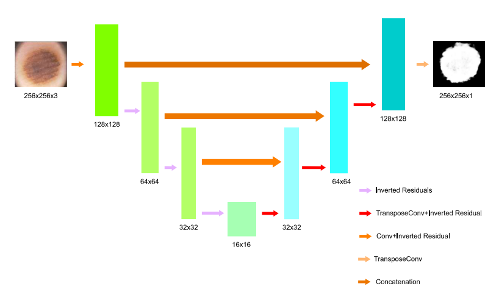

# Medical-Image-Segmentation
In this repo we have implemented various state-of-the-art techniques for Medical Image Segmentation and compared it with U-Net with MobileNetV2's performance on [brain tumor](https://www.kaggle.com/datasets/masoudnickparvar/brain-tumor-mri-dataset) and [skin lesion](https://www.kaggle.com/datasets/andrewmvd/isic-2019) datasets sourced from kaggle. This was done and implemented using Jupyter notebooks.

#Architecture

