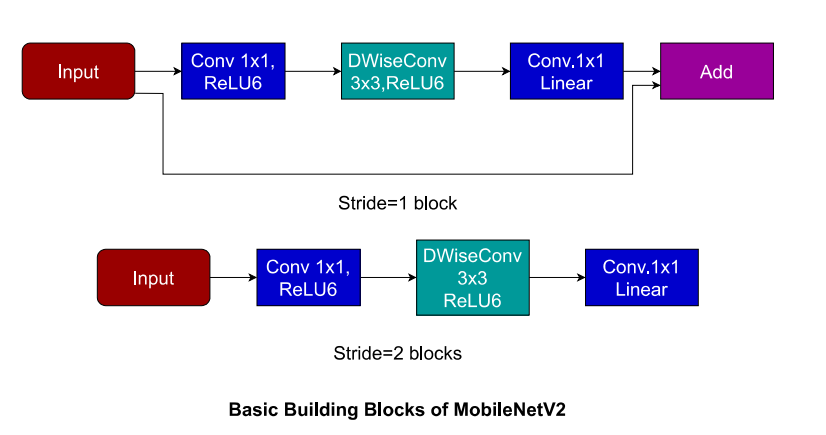
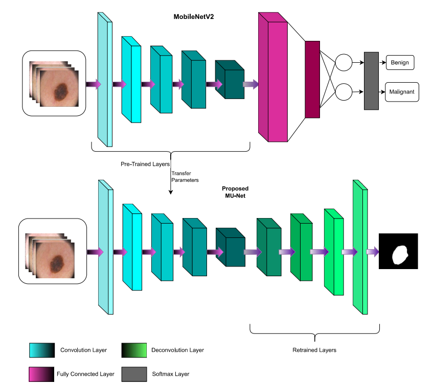

# Medical-Image-Segmentation
In this repo we have implemented various state-of-the-art techniques for Medical Image Segmentation and compared it with U-Net with MobileNetV2's performance on [brain tumor](https://www.kaggle.com/datasets/masoudnickparvar/brain-tumor-mri-dataset) and [skin lesion](https://www.kaggle.com/datasets/andrewmvd/isic-2019) datasets sourced from kaggle. This was done and implemented using Jupyter notebooks.

Architecture
------------
U-Net is a very famous Deep Learning Architecture used in Image Segmentation. It combines local informationn from encoder part with contextual information from decoder part making it very effective for segmentation. There have been various attempts at maintaining or improving accuracy of U-Net through using pre-trained networks for the downsampling path so as to reduce computation. Also this usage of pre-trained networks can help in Medical Image Segmentation especially as these tend to have small datasets and insufficient data leads to overfitting.

MobileNetV2 is an architecture which was proposed to classify images with least computing power and it has the potential to even work on less computing power devices like Mobile Phones(and thus the name). One of the main proosals of MobileNet has been usage of DepthWiseSeparable Convolutions over Normal Convolutions and this has allowed less number of multiplication operations for the same dimensions. It also involves usage of linear bottlenecks and inverted residuals to better predict image class. 

We have trained MobileNetV2 on a large dataset and have applied the same weights here for the U-Net encoder part. We called the resulting architecture MU-Net and it has shown promising results. 

